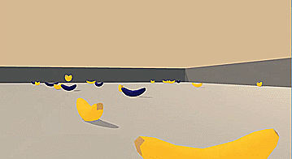
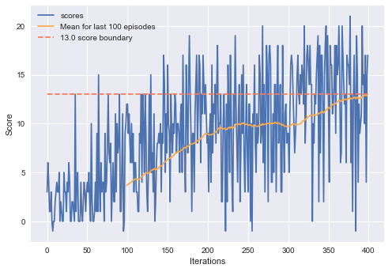

# Deep Q Unity Bananer
Showcase of DQN implementation in Tensorflow.



An agent will learn the art of picking up yellow (and only yellow) bananas in a Unity environment made by Udacity.

## Environment
Agent *sees* the world via 1D vector of 37 values and interacts with it by choosing one of 4 possible actions (go forward, backpedal, rotate left, rotate right).
It is provided with a reward of +1 for every yellow banana and -1 for every blue banana it picks up (steps on).
Environment is considered solved when agent gets mean score over 13 for 100 episodes.

## Algorithm
Agent's brain is Deep Q-network, a Reinforcement Learning algorithm which enables agent to learn via interaction with the world. Network's architecture consists of two hidden layers with 128 neurons, 37 neurons as input and 4 values as output. Value of each output corresponds to expected reward for performing the action.

## Results
Agent was able to solve the environment in as little as 400 episodes.



## Installation
#### Pre-requisites
Packages:
- Tensorflow (tested on version 1.12.0)
- Numpy (tested on 1.14.3)
- UnityAgents
  
Additionaly, Jupyter notebook (or Jupyter lab) for displaying solution

#### Process
You need to manually download environment binaries for your system:
- [Linux](https://s3-us-west-1.amazonaws.com/udacity-drlnd/P1/Banana/Banana_Linux.zip)
- [MacOSX](https://s3-us-west-1.amazonaws.com/udacity-drlnd/P1/Banana/Banana.app.zip)
- [Windows (32-bit)](https://s3-us-west-1.amazonaws.com/udacity-drlnd/P1/Banana/Banana_Windows_x86.zip)
- [Windows (64-bit)](https://s3-us-west-1.amazonaws.com/udacity-drlnd/P1/Banana/Banana_Windows_x86_64.zip)
  
After downloading, unpack all files and place them in directory `data/`. Then, swap string in cell 4 
```
env = UnityEnvironment(file_name = "data/Banana.exe")
```
with one proper to your OS.
