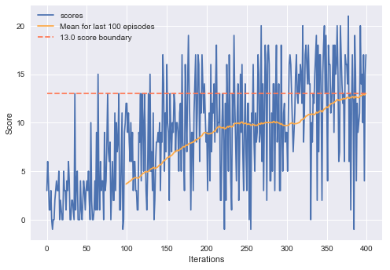

# Algorithm overview
Agent's brain is Deep Q-network, a Reinforcement Learning algorithm which enables agent to learn via interaction with the world.

## Parameters
Network architecture:
| Layer    | Neurons | Shape      |
|----------|---------|------------|
| Input    | 37      | (None, 37) |
| Hidden 1 | 128     | (None, 128)|
| Hidden 2 | 128     | (None, 128)|
| Output   | 4       | (None, 4)  |

Used hyperparameters:
|                   |       |
|-------------------|-------|
| Buffer size       | 1e5   |
| Batch size        | 64    |
| Discount factor   | 0.99  |
| Soft update factor| 1e-3  |
| Learning rate     | 5e-4  |

## Results
Agent was able to solve the environment in as little as 400 episodes.

## Further development
Quality of algorithm could be further enhanced by using various additions, such as Dueling DQN or Prioritized Replay Buffer. 